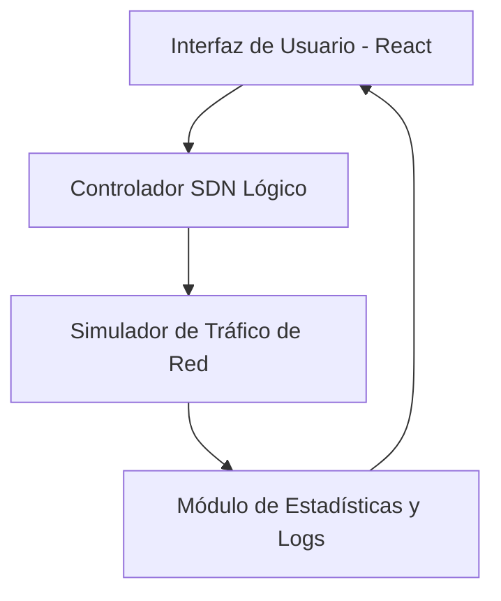

# Propuesta de Diseño de Referencia (PDR)
## Aplicación: SDN Traffic Master

Este documento define las especificaciones funcionales, pedagógicas y técnicas para el desarrollo de la aplicación web educativa **SDN Traffic Master**. El diseño cruza la teoría de Redes Definidas por Software (SDN) con la metodología de Aprendizaje Basado en Problemas (ABP) y mecánicas de juego orientadas a la gestión de recursos.

---

### 1. Ficha Técnica de Integración

| Dimensión | Elemento Seleccionado | Implementación en la Aplicación |
| :--- | :--- | :--- |
| **Tema (Cuaderno A)** | Redes Definidas por Software (SDN) | Separación del Plano de Control (controlador lógico) y el Plano de Datos (conmutadores OpenFlow). |
| **Estrategia (Cuaderno B)** | Aprendizaje Basado en Problemas (ABP) | Escenarios de cuellos de botella en la red donde los estudiantes deben resolver congestiones de tráfico reales mediante políticas de ruteo. |
| **Mecánica (Cuaderno C)** | Gestión de Recursos / Boss Final | Optimización de enlaces de ancho de banda como recursos limitados, culminando en un desafío de colapso de red en tiempo real (Boss Final). |

---

### 2. Objetivos de Aprendizaje

Al finalizar la experiencia interactiva con la aplicación, el estudiante será capaz de:
1. **Diferenciar** de manera práctica el plano de control (donde se toman decisiones globales de tráfico) del plano de datos (donde los conmutadores reenvían paquetes).
2. **Diagnosticar** cuellos de botella, pérdida de paquetes y latencia excesiva en una topología de red simulada.
3. **Programar y aplicar** reglas lógicas de flujo de red en un controlador SDN para optimizar el rendimiento general bajo limitaciones físicas de ancho de banda.

---

### 3. Concepto General y Mecánica de Juego

El estudiante asume el papel de un **Ingeniero de Tránsito de Red** en un centro de datos. El juego se desarrolla sobre un simulador visual de topología de red (plano de datos) que representa switches conectados entre sí y servidores de destino.

*   **El Problema (ABP):** A la red ingresan ráfagas de tráfico heterogéneo (streaming de video, consultas a bases de datos, VoIP, etc.) que deben ser enrutadas hacia sus destinos correctos. Los enlaces físicos tienen límites estrictos de capacidad (ancho de banda). Si un enlace se satura, los paquetes se pierden y la latencia sube, reduciendo la puntuación del estudiante.
*   **La Solución (SDN):** En lugar de configurar cada switch individualmente, el estudiante interactúa con una **Consola de Control SDN centralizada** (plano de control). Desde allí, redacta "reglas de flujo" lógicas (ej. *si el tráfico es de tipo VoIP, desviarlo por el enlace de menor latencia; si es backup, usar enlaces de baja prioridad*).
*   **Gestión de Recursos (Mecánica C):** El estudiante cuenta con una cantidad limitada de "Presupuesto de Procesamiento" del controlador (CPU/Memoria del switch) para implementar reglas de flujo complejas. Debe equilibrar la complejidad de las reglas con el rendimiento físico de los canales de comunicación.
*   **El Boss Final (Mecánica C):** Tras superar los problemas iniciales, el estudiante se enfrenta al desafío definitivo: una tormenta de tráfico dinámico en tiempo real y el fallo de un enlace principal de fibra óptica. El alumno debe reconfigurar en vivo las reglas del controlador SDN para redirigir el tráfico crítico antes de que colapse todo el sistema.

---

### 4. Especificaciones del Interfaz de Usuario (UI/UX)

La aplicación se diseñará como un panel de control tecnológico moderno, responsivo y dinámico, estructurado en tres secciones principales:

1.  **Visualizador de Topología (Plano de Datos):**
    *   Un lienzo interactivo (SVG o Canvas) que dibuja los conmutadores (Switches), clientes y servidores.
    *   Los enlaces se representan con líneas de colores dinámicos según su uso de ancho de banda (verde = libre, amarillo = óptimo, rojo = saturado/pérdida).
    *   Partículas visuales representarán los paquetes de datos fluyendo por los canales para dar retroalimentación inmediata sobre el volumen de tráfico.
2.  **Consola SDN (Plano de Control):**
    *   Un panel lateral donde el estudiante define las políticas de red.
    *   Interfaz amigable basada en reglas lógicas condicionales (*IF [Tipo de Tráfico] THEN ROUTE VIA [Switch ID]*).
    *   Indicadores en tiempo real de recursos consumidos (latencia promedio, porcentaje de paquetes perdidos, rendimiento de red general).
3.  **Consola de Estadísticas e Historial (Feedback Inmediato):**
    *   Gráficas de rendimiento que muestran la evolución del tráfico, permitiendo analizar de inmediato el efecto de aplicar o retirar una regla del controlador.

---

### 5. Arquitectura del Simulador y Lógica de Datos

La aplicación se estructurará modularmente en Frontend puro (React + Vite + TypeScript) para garantizar su portabilidad:

*   **Estructuras de Datos Clave:**
    *   `Node`: Representa un elemento de red (Switch, Host, Servidor) con atributos de capacidad.
    *   `Link`: Define las conexiones con propiedades físicas de `bandwidthLimit`, `currentUsage`, `latency` y `packetLossRate`.
    *   `FlowRule`: La regla lógica definida por el alumno (*Source, Destination, TrafficType, ActionPath*).
    *   `Packet`: La entidad que viaja por la red con su tipo de datos, peso (Mbps) y tiempo de vida (TTL).

---

### 6. Criterio de Éxito y Validación (Criterio de "Listo")

Para declarar la aplicación como finalizada y correcta, debe cumplir con los siguientes puntos de verificación:
*   [ ] Al aplicar una regla en la Consola SDN, el flujo de paquetes debe cambiar visualmente en la topología al instante.
*   [ ] El simulador debe calcular correctamente la latencia acumulada y el desborde (pérdida de paquetes) de los enlaces cuando la suma de tráfico supera la capacidad máxima del canal.
*   [ ] Debe existir un flujo completo de juego: introducción de un escenario problemático, espacio para editar las reglas lógicas, simulación activa, y la fase del Boss Final con fallos aleatorios de enlaces.
*   [ ] Interfaz responsiva y fluida en navegadores de escritorio modernos (Chrome, Firefox, Safari).
